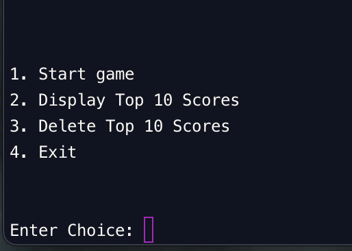
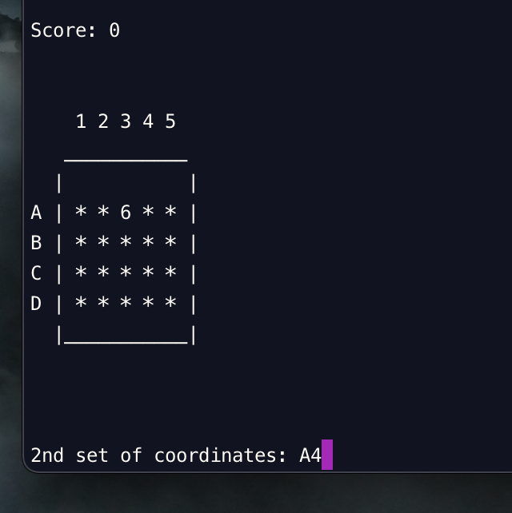
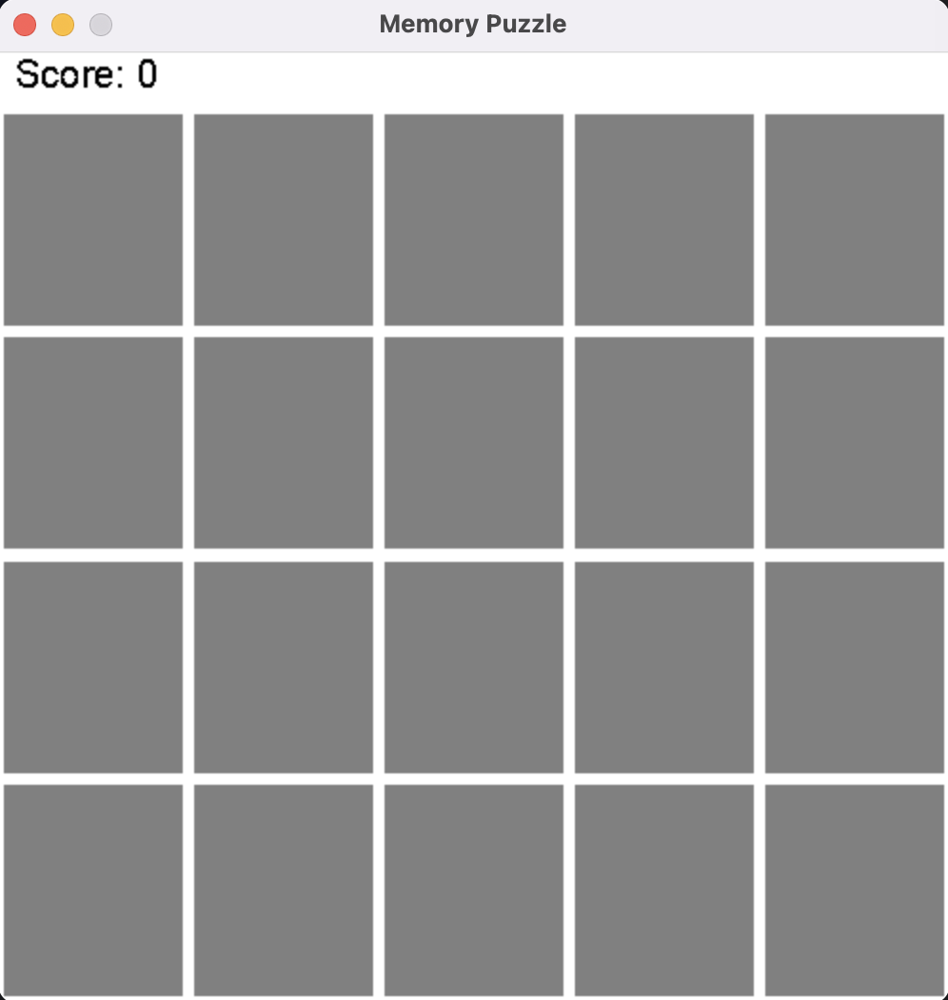
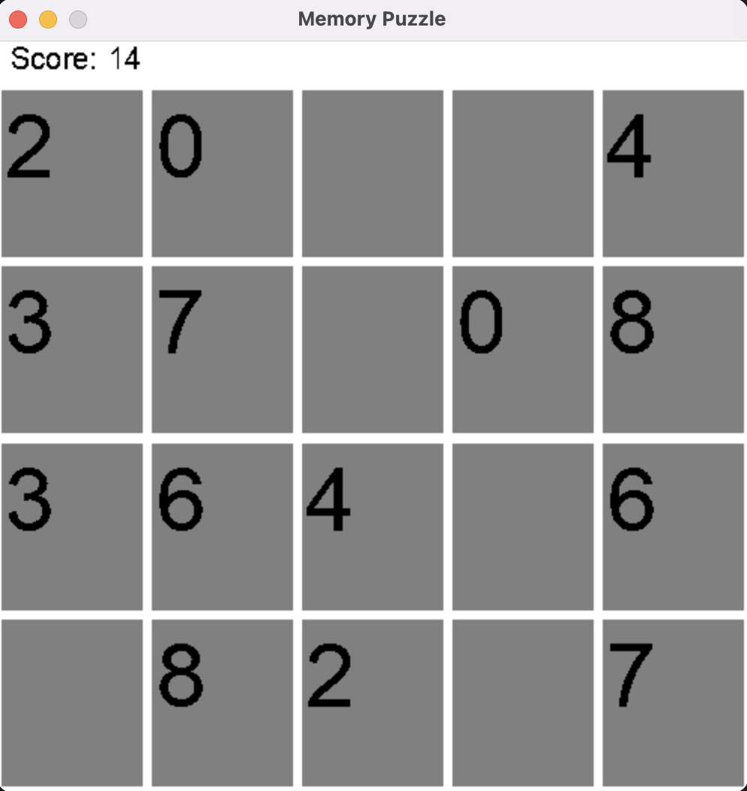

# Memory Puzzle

memory puzzle game for python3.

This is CLI game, which can be played on the terminal itself.

It was fun to work on the game mechanics.
Below are some screenshots of the game -

## Screenshot 1

## Screenshot 2

Below is the GUI version (contributed by ) -
## Screenshot 3

## Screenshot 4
